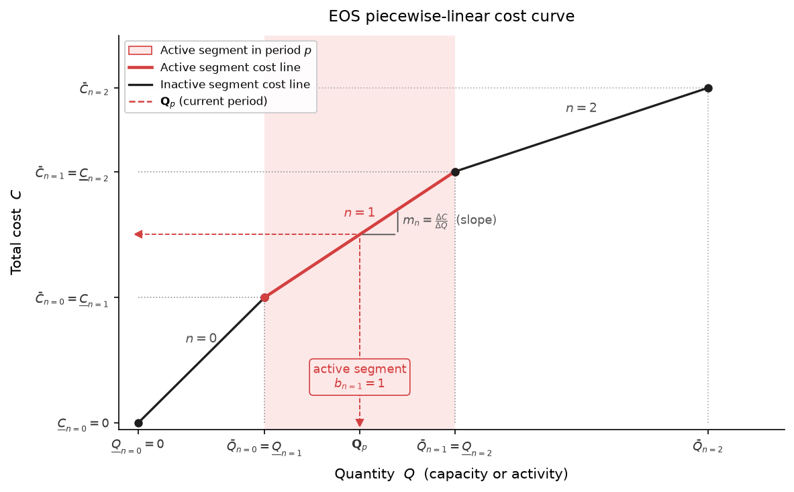

.. _extension-eos:

Economies of Scale (EOS)
========================

The **eos** extension adds piecewise-linear cost curves to three cost
types: investment (:code:`cost_invest_eos`), fixed O&M
(:code:`cost_fixed_eos`), and variable O&M (:code:`cost_variable_eos`).
It is disabled by default and enabled per run through configuration:

.. code-block:: toml

   extensions = ["eos"]

All three features share the same binary-integer formulation: a set of
contiguous segments, exactly one of which is active per cluster per period.
They differ in what quantity drives the cost curve (cumulative capacity,
available capacity, or activity) and in how the resulting cost is
discounted and added to the objective.

   **EOS piecewise-linear cost curve.** The curve is composed of contiguous
   segments :math:`n=0,1,2` (three shown here), each with its own quantity
   bounds :math:`[\underline{Q}_{n}, \overline{Q}_{n}]` and corresponding
   total-cost bounds :math:`[\underline{C}_{n}, \overline{C}_{n}]`.  The
   slope :math:`m_n` is the marginal cost within segment :math:`n`.  In this
   period, segment :math:`n=1` is **active** (red shading): the binary
   variable is 1, and the quantity variable :math:`\textbf{Q}_p` lies within
   its bounds.

Overview
--------

.. list-table::
   :header-rows: 1
   :widths: 22 20 20 38

   * - Feature
     - Table
     - Cost type
     - Curve driven by
   * - :ref:`cost_invest_eos <eos-invest>`
     - :code:`cost_invest_eos`
     - Investment (:code:`cost_invest`)
     - **Cumulative capacity** built up to period :math:`p` (learning curve)
   * - :ref:`cost_fixed_eos <eos-fixed>`
     - :code:`cost_fixed_eos`
     - Fixed O&M (:code:`cost_fixed`)
     - **Available capacity** in period :math:`p`
   * - :ref:`cost_variable_eos <eos-variable>`
     - :code:`cost_variable_eos`
     - Variable O&M (:code:`cost_variable`)
     - **Total activity** (output flow) in period :math:`p`

Technologies subject to EOS are specified as *clusters* identified by a
region/group label :math:`r` and a technology/group label :math:`t`.
Each cluster has a piecewise-linear cost curve defined by contiguous
segments :math:`n \in N_{r,t}` (for invest) or
:math:`n \in N_{r,p,t}` (for fixed/variable, which are
period-specific).

.. note::

   The :code:`tech_or_group` column accepts either an individual technology
   name or a technology-group name.  When a group is used, all member
   technologies share the same cost curve and their contributions to the
   driving quantity (capacity or activity) are summed.  For
   :code:`cost_invest_eos`, all technologies in a cluster must share the
   same :code:`lifetime_process`, :code:`lifetime_survival_curve`,
   :code:`loan_lifetime_process`, and :code:`loan_rate` in every period
   they appear together.

.. _eos-invest:

cost_invest_eos — Investment Cost Curve
----------------------------------------

Concept
~~~~~~~

:code:`cost_invest_eos` replaces (or supplements) the flat per-unit
investment cost for a cluster with a piecewise-linear curve whose marginal
cost changes with *cumulative* installed capacity — a learning-curve
effect.  The curve is global across time: each successive period inherits
the capacity built in all previous periods.  The incremental investment cost
charged in period :math:`p` is the difference between the curve evaluated at
cumulative capacity up to :math:`p` and the curve evaluated at the end of
the previous period, so that each unit of new capacity is charged at the
marginal cost appropriate to the total deployment level at the time of
construction.

.. note::

   The cumulative capacity **includes pre-existing capacity** (from the
   :code:`existing_capacity` table), but pre-existing capacity does not
   incur an investment cost — it is subtracted out when computing the
   incremental period cost.  The first segment's lower bound can almost
   always be set to 0 regardless of how much capacity already exists.

.. note::

   EOS invest processes can carry a flat investment cost via
   :code:`cost_invest` in addition to the piecewise curve.

Table: cost_invest_eos
~~~~~~~~~~~~~~~~~~~~~~

:math:`{CIEOS}_{r \in R,\, t \in T,\, n \in \mathbb{Z}^+}`

The segment index :math:`n` is an integer; segments must be numbered
consecutively and their capacity bounds must be contiguous.  All four bound
columns must be non-negative and strictly increasing within a segment.

.. csv-table::
   :header: "Column", "Symbol", "Description"
   :widths: 22, 18, 60

   ":code:`region`", ":math:`r`", "region or region-group label"
   ":code:`tech_or_group`", ":math:`t`", "technology or technology-group label"
   ":code:`segment`", ":math:`n`", "integer segment index (contiguous)"
   ":code:`capacity_lower`", ":math:`\underline{K}_{r,t,n}`", "lower cumulative-capacity bound of the segment"
   ":code:`capacity_upper`", ":math:`\overline{K}_{r,t,n}`", "upper cumulative-capacity bound of the segment"
   ":code:`cost_lower`", ":math:`\underline{C}_{r,t,n}`", "investment cost at :math:`\underline{K}_{r,t,n}` (same units as :code:`cost_invest`)"
   ":code:`cost_upper`", ":math:`\overline{C}_{r,t,n}`", "investment cost at :math:`\overline{K}_{r,t,n}`"

Sets
~~~~

.. csv-table::
   :header: "Set", "Indices", "Description"
   :widths: 38, 18, 44

   ":code:`cost_invest_eos_rtn`", ":math:`(r, t, n)`", "valid cluster–segment combinations; populated directly from the table"
   ":code:`cost_invest_eos_segment_rptn`", ":math:`(r, p, t, n)`", "valid cluster–period–segment combinations; derived from :code:`cost_invest_eos_rtn` and :code:`process_vintages`"
   ":code:`cost_invest_eos_period_rpt`", ":math:`(r, p, t)`", "projection of :code:`cost_invest_eos_segment_rptn` onto :math:`(r, p, t)`"

Variables
~~~~~~~~~

.. csv-table::
   :header: "Variable", "Domain", "Indices", "Description"
   :widths: 36, 12, 24, 28

   ":math:`\textbf{CIECAP}_{r,p,t,n}` (:code:`v_cost_invest_eos_cumulative_capacity`)", ":math:`\mathbb{R}_{\ge 0}`", ":math:`(r, p, t, n) \in \Theta_{\text{cost\_invest\_eos\_segment\_rptn}}`", "cumulative capacity assigned to segment :math:`n` of cluster :math:`(r,t)` in period :math:`p`"
   ":math:`\textbf{CIEB}_{r,p,t,n}` (:code:`v_cost_invest_eos_segment_binary`)", ":math:`\{0, 1\}`", ":math:`(r, p, t, n) \in \Theta_{\text{cost\_invest\_eos\_segment\_rptn}}`", "1 if segment :math:`n` is the active segment for cluster :math:`(r,t)` in period :math:`p`"

Constraints
~~~~~~~~~~~

.. autofunction:: temoa.extensions.economies_of_scale.components.cost_invest_eos.cost_invest_eos_segment_binary_constraint

.. autofunction:: temoa.extensions.economies_of_scale.components.cost_invest_eos.cost_invest_eos_capacity_lower_bound_constraint

.. autofunction:: temoa.extensions.economies_of_scale.components.cost_invest_eos.cost_invest_eos_capacity_upper_bound_constraint

.. autofunction:: temoa.extensions.economies_of_scale.components.cost_invest_eos.cost_invest_eos_cumulative_capacity_constraint

Objective Contribution
~~~~~~~~~~~~~~~~~~~~~~

.. autofunction:: temoa.extensions.economies_of_scale.components.cost_invest_eos.period_cost

.. _eos-fixed:

cost_fixed_eos — Fixed O&M Cost Curve
--------------------------------------

Concept
~~~~~~~

:code:`cost_fixed_eos` replaces (or supplements) the flat per-unit fixed
O&M cost for a cluster with a piecewise-linear curve whose unit cost
changes with *available capacity* in each period independently.  Unlike
:code:`cost_invest_eos`, the cost curve is period-specific: segments can
differ from one period to the next, allowing the modeller to represent
O&M cost trends over time separately from capacity-scale effects.

Table: cost_fixed_eos
~~~~~~~~~~~~~~~~~~~~~

:math:`{CFEOS}_{r \in R,\, p \in P,\, t \in T,\, n \in \mathbb{Z}^+}`

.. csv-table::
   :header: "Column", "Symbol", "Description"
   :widths: 22, 18, 60

   ":code:`region`", ":math:`r`", "region or region-group label"
   ":code:`period`", ":math:`p`", "model period"
   ":code:`tech_or_group`", ":math:`t`", "technology or technology-group label"
   ":code:`segment`", ":math:`n`", "integer segment index (contiguous)"
   ":code:`capacity_lower`", ":math:`\underline{K}_{r,p,t,n}`", "lower capacity bound of the segment"
   ":code:`capacity_upper`", ":math:`\overline{K}_{r,p,t,n}`", "upper capacity bound of the segment"
   ":code:`cost_lower`", ":math:`\underline{C}_{r,p,t,n}`", "fixed O&M cost at :math:`\underline{K}_{r,p,t,n}` (same units as :code:`cost_fixed`)"
   ":code:`cost_upper`", ":math:`\overline{C}_{r,p,t,n}`", "fixed O&M cost at :math:`\overline{K}_{r,p,t,n}`"

Sets
~~~~

.. csv-table::
   :header: "Set", "Indices", "Description"
   :widths: 36, 20, 44

   ":code:`cost_fixed_eos_rptn`", ":math:`(r, p, t, n)`", "valid cluster–period–segment combinations"
   ":code:`cost_fixed_eos_period_rpt`", ":math:`(r, p, t)`", "projection of :code:`cost_fixed_eos_rptn` onto :math:`(r, p, t)`"

Variables
~~~~~~~~~

.. csv-table::
   :header: "Variable", "Domain", "Indices", "Description"
   :widths: 36, 12, 24, 28

   ":math:`\textbf{CFECAP}_{r,p,t,n}` (:code:`v_cost_fixed_eos_capacity`)", ":math:`\mathbb{R}_{\ge 0}`", ":math:`(r, p, t, n) \in \Theta_{\text{cost\_fixed\_eos\_rptn}}`", "capacity assigned to segment :math:`n` of cluster :math:`(r,p,t)`"
   ":math:`\textbf{CFEB}_{r,p,t,n}` (:code:`v_cost_fixed_eos_segment_binary`)", ":math:`\{0, 1\}`", ":math:`(r, p, t, n) \in \Theta_{\text{cost\_fixed\_eos\_rptn}}`", "1 if segment :math:`n` is active for cluster :math:`(r,p,t)`"

Constraints
~~~~~~~~~~~

.. autofunction:: temoa.extensions.economies_of_scale.components.cost_fixed_eos.cost_fixed_eos_segment_binary_constraint

.. autofunction:: temoa.extensions.economies_of_scale.components.cost_fixed_eos.cost_fixed_eos_capacity_lower_bound_constraint

.. autofunction:: temoa.extensions.economies_of_scale.components.cost_fixed_eos.cost_fixed_eos_capacity_upper_bound_constraint

.. autofunction:: temoa.extensions.economies_of_scale.components.cost_fixed_eos.cost_fixed_eos_capacity_constraint

Objective Contribution
~~~~~~~~~~~~~~~~~~~~~~

.. autofunction:: temoa.extensions.economies_of_scale.components.cost_fixed_eos.period_cost

.. _eos-variable:

cost_variable_eos — Variable O&M Cost Curve
--------------------------------------------

Concept
~~~~~~~

:code:`cost_variable_eos` replaces (or supplements) the flat per-unit
variable O&M cost for a cluster with a piecewise-linear curve whose unit
cost changes with *total activity* (output flow) in each period
independently.  Like :code:`cost_fixed_eos`, the cost curve is
period-specific.  This allows the modeller to represent dispatch-scale
economies (e.g. fuel-handling efficiency at high utilisation rates) that
vary over time.

Table: cost_variable_eos
~~~~~~~~~~~~~~~~~~~~~~~~

:math:`{CVEOS}_{r \in R,\, p \in P,\, t \in T,\, n \in \mathbb{Z}^+}`

.. csv-table::
   :header: "Column", "Symbol", "Description"
   :widths: 22, 18, 60

   ":code:`region`", ":math:`r`", "region or region-group label"
   ":code:`period`", ":math:`p`", "model period"
   ":code:`tech_or_group`", ":math:`t`", "technology or technology-group label"
   ":code:`segment`", ":math:`n`", "integer segment index (contiguous)"
   ":code:`activity_lower`", ":math:`\underline{A}_{r,p,t,n}`", "lower activity bound of the segment"
   ":code:`activity_upper`", ":math:`\overline{A}_{r,p,t,n}`", "upper activity bound of the segment"
   ":code:`cost_lower`", ":math:`\underline{C}_{r,p,t,n}`", "variable O&M cost at :math:`\underline{A}_{r,p,t,n}` (same units as :code:`cost_variable`)"
   ":code:`cost_upper`", ":math:`\overline{C}_{r,p,t,n}`", "variable O&M cost at :math:`\overline{A}_{r,p,t,n}`"

Sets
~~~~

.. csv-table::
   :header: "Set", "Indices", "Description"
   :widths: 36, 20, 44

   ":code:`cost_variable_eos_rptn`", ":math:`(r, p, t, n)`", "valid cluster–period–segment combinations"
   ":code:`cost_variable_eos_period_rpt`", ":math:`(r, p, t)`", "projection of :code:`cost_variable_eos_rptn` onto :math:`(r, p, t)`"

Variables
~~~~~~~~~

.. csv-table::
   :header: "Variable", "Domain", "Indices", "Description"
   :widths: 36, 12, 24, 28

   ":math:`\textbf{CVEACT}_{r,p,t,n}` (:code:`v_cost_variable_eos_activity`)", ":math:`\mathbb{R}_{\ge 0}`", ":math:`(r, p, t, n) \in \Theta_{\text{cost\_variable\_eos\_rptn}}`", "activity assigned to segment :math:`n` of cluster :math:`(r,p,t)`"
   ":math:`\textbf{CVEB}_{r,p,t,n}` (:code:`v_cost_variable_eos_segment_binary`)", ":math:`\{0, 1\}`", ":math:`(r, p, t, n) \in \Theta_{\text{cost\_variable\_eos\_rptn}}`", "1 if segment :math:`n` is active for cluster :math:`(r,p,t)`"

Constraints
~~~~~~~~~~~

.. autofunction:: temoa.extensions.economies_of_scale.components.cost_variable_eos.cost_variable_eos_segment_binary_constraint

.. autofunction:: temoa.extensions.economies_of_scale.components.cost_variable_eos.cost_variable_eos_activity_lower_bound_constraint

.. autofunction:: temoa.extensions.economies_of_scale.components.cost_variable_eos.cost_variable_eos_activity_upper_bound_constraint

.. autofunction:: temoa.extensions.economies_of_scale.components.cost_variable_eos.cost_variable_eos_activity_constraint

Objective Contribution
~~~~~~~~~~~~~~~~~~~~~~

.. autofunction:: temoa.extensions.economies_of_scale.components.cost_variable_eos.period_cost
