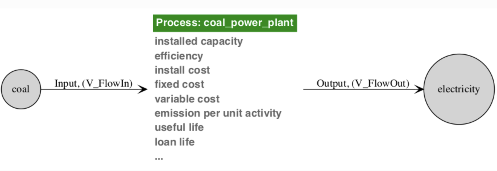

========================
Mathematical Formulation
========================

To understand this section, the reader will need at least a cursory
understanding of mathematical optimization.  We omit here that introduction,
and instead refer the reader to `various`_ `available`_ `online`_ `sources`_.
Temoa is formulated as an algebraic model that requires information organized
into sets, parameters, variables, and equation
definitions.

The heart of Temoa is a technology explicit energy system optimization model.
It is an algebraic network of linked processes -- where each process is defined
by a set of engineering characteristics (e.g. capital cost, efficiency, capacity
factor, emission rates) -- that transform raw energy sources into end-use
demands.  The model objective function minimizes the present-value cost of
energy supply by optimizing installed capacity and its utilization over time.

.. _simple_system:

.. figure:: images/simple_system2.*
   :align: center
   :width: 100%
   :alt: A simple energy system, with energy sources on the left and energy
         sinks (end-use demands) on the right.
   :figclass: align-center
   :figwidth: 70%

   A common visualization of energy system models is a directed network graph,
   with energy sources on the left and end-use demands on the right.  The
   modeler must specify the end-use demands to be met, the technologies defined
   within the system (rectangles), and the inputs and outputs of each (red and green
   arrows).  The circles represent distinct energy carriers that connect
   technologies within the energy system network.

The most fundamental tenet of the model is the understanding of energy flow,
treating all processes as black boxes that take inputs and produce outputs.
Specifically, Temoa does not care about the inner workings of a process, only
its global input and output characteristics.  In this vein, the above graphic
can be broken down into process-specific elements.  For example, the coal power
plant takes as input coal and produces electricity, and is subject to various
costs (e.g. variable costs) and constraints (e.g. efficiency) along the way.

The modeler defines the processes and engineering characteristics through a
combination of sets and parameters, described in the next few sections.  Temoa then
utilizes these parameters, along with the associated technology-specific decision
variables for capacity and activity, to create the objective function and
constraints that are used during the optimization process.

Temoa Notation
--------------

In the mathematical notation, we use CAPITALIZATION to denote a container,
like a set, indexed variable, or indexed parameter.  Sets use only a single
letter, so we use the lower case to represent an item from the set.  For
example, :math:`T` represents the set of all technologies and :math:`t`
represents a single item from :math:`T`.

 * Variables are named V\_VarName within the code to aid readability.  However,
   in the documentation where there is benefit of italics and other font
   manipulations, we elide the 'V\_' prefix.

 * In all equations, we **bold** variables to distinguish them from parameters.
   Take, for example, this excerpt from the Temoa default objective function:

   .. math::
      C_{variable} = \sum_{r, p, s, d, i, t, v, o \in \Theta_{VC}} \left (
              {VC}_{r, p, t, v}
        \cdot R_p
        \cdot \textbf{FO}_{r, p, s, d, i, t, v, o}
        \right )

   Note that :math:`C_{variable}` is not bold, as it is a temporary variable
   used for clarity while constructing the objective function.  It is not a
   structural variable and the solver never sees it.

 * Where appropriate, we put the variable on the right side of the coefficient.
   In other words, this is not a preferred form of the previous equation:

   .. math::

      C_{variable} = \sum_{r, p, s, d, i, t, v, o \in \Theta_{VC}} \left (
              \textbf{FO}_{r, p, s, d, i, t, v, o}
        \cdot {VC}_{r, p, t, v}
        \cdot R_p
        \right )

 * We generally put the limiting or defining aspect of an equation on the right
   hand side of the relational operator, and the aspect being limited or defined
   on the left hand side.  For example, equation :eq:`Capacity` defines Temoa's
   mathematical understanding of a process capacity (:math:`\textbf{CAP}`) in
   terms of that process' activity (:math:`\textbf{ACT}`):

   .. math::

       \left (
               \text{CFP}_{r, s, d, t, v}
         \cdot \text{C2A}_{r, t}
         \cdot \text{SEG}_{s, d}
       \right )
       \cdot \textbf{CAP}_{r, t, v}
    =
       \sum_{I, O} \textbf{FO}_{r, p, s, d,i, t, v, o}
    +
       \sum_{I, O} \textbf{CUR}_{r, p, s, d, i, t, v, o}

       \\
       \forall \{r, p, s, d, t, v\} \in \Theta_{\text{FO}}

 * We use the word 'slice' to refer to the tuple of season and time of day
   :math:`\{s,d\}`. Note that these time slices are user-defined, and can
   represent time ranging large blocks of time (e.g., winter-night) to every
   hour in a given season.

 * We use the word 'process' to refer to the tuple of technology and vintage
   (:math:`\{t,v\}`). For example, solar PV (technology) installed in 2030
   (vintage).

Treatment of Time
-----------------
Temoa's conceptual model of *time* is broken up into three levels, and energy supply
and demand is balanced at each of these levels:

 * **Periods** - consecutive blocks of years, marked by the first year in the
   period.  For example, a two-period model might consist of :math:`\text{P}^f =
   \{2010, 2015, 2025\}`, representing the two periods of years from 2010
   to 2015, and from 2015 to 2025. It is up to the model builder whether this represents start
   of year to start of year or end of year to end of year. Note that the last period element
   (2025) does not represent a new time period, but rather defines the end of the second time
   period and therefore the planning horizon.

 * **Seasonal** - Each year is divided into one or more seasons.  What a "season"
   represents depends on the :code:`time_sequencing` mode chosen in the configuration
   file (see below).  Each season carries a :code:`segment_fraction` value in the
   :code:`time_season` table specifying the fraction of the year it represents.

 * **Daily** - Within each season, the day is subdivided into one or more
   time-of-day segments.  Each segment has an associated :code:`hours` value in the
   :code:`time_of_day` table indicating how many hours it represents (e.g. 8 hours for
   "Day", 16 hours for "Night").  Less detailed databases may use a single segment
   covering the full day.

We use the word 'slice' or 'timeslice' to refer to the tuple of season and time of day
:math:`\{s,d\}`. The fraction of a year represented by each slice is computed
automatically:

.. math::

   SEG_{s,d} = \text{segment\_fraction\_per\_season}(s) \;\times\; \frac{\text{hours}(d)}
               {\sum_{d'} \text{hours}(d')}

The sum of :math:`SEG_{s,d}` over all :math:`(s,d)` pairs must equal 1.

Time Sequencing Modes
~~~~~~~~~~~~~~~~~~~~~

Temoa v4 supports four modes for interpreting the meaning and ordering of seasons,
controlled by the :code:`time_sequencing` setting in the configuration TOML file:

 * **consecutive_days** — Each season represents a single day, and the seasons are
   treated as consecutive days in order.  Use this when modeling e.g., a representative
   week (7 seasons) or a full year (365 seasons).  Inter-season state (e.g. for
   storage) carries forward naturally from one season to the next, so the
   :code:`time_season_sequential` table can be left empty (more on that below).

 * **seasonal_timeslices** *(default)* — Each season represents a sequential slice of
   the year containing one or many days (e.g. Winter, Spring, Summer, Fall).  The
   true chronological sequence is assumed to follow the :code:`time_season` ordering,
   so the :code:`time_season_sequential` table can be left empty.  This is the
   traditional Temoa time representation.

 * **representative_periods** — Each season represents a block of days that may not
   be contiguous in time (e.g. a "typical summer weekday" drawn from several months).
   If the model uses inter-season constraints such as seasonal storage or
   inter-season ramping, the true chronological sequence must be defined in the
   :code:`time_season_sequential` table.  Technologies using seasonal storage must
   also be flagged in the :code:`technology` table.

 * **manual** — The sequence of time slices is defined explicitly by the modeler in
   an optional :code:`time_manual` table.  This is an advanced feature provided in
   case none of the above modes are suitable, and is not recommended for most users.

The selected mode, in combination with the sequence of the :code:`time_season` and
:code:`time_of_day` tables, is
used to construct the :code:`time_next` dictionary, which maps each :math:`(s,d)` time
slice to its successor in the chronological sequence, :math:`(s_{next}, d_{next})`.

The :code:`days_per_period` configuration setting (default: 365) specifies how many
days each planning period's representative year encompasses.  This is used to scale
flow variables correctly.  For example, reduce it to 7 when modeling a single
representative week.

Time Season Sequential
~~~~~~~~~~~~~~~~~~~~~~

When using the **representative_periods** time sequencing mode, the seasons in
:code:`time_season` may represent non-contiguous blocks of time (e.g. a "typical
summer weekday" drawn from several calendar months).  For constraints that depend
on inter-season ordering — seasonal storage and inter-season ramping — the model
needs to know the true chronological sequence showing how the representative seasons
are stitched together to form a complete year.

The :code:`time_season_sequential` table provides this mapping.  Each row defines
a *sequential season* (:code:`seas_seq`) that references one of the
:code:`time_season` entries and carries its own :code:`segment_fraction` and an
integer :code:`sequence` column that determines the chronological order.  Because
the same representative season may appear more than once in the reconstructed year
(e.g. "typical summer weekday" could appear for June, July, and August), the sequential table can
contain multiple entries that map back to the same :code:`time_season` row, each
with its own fraction.

From this table Temoa builds two internal dictionaries:

* :code:`time_next_sequential` — maps each sequential season to its successor,
  forming a circular chain that represents the annual cycle.
* :code:`sequential_to_season` — maps each sequential season back to its parent
  representative season in :code:`time_season`.

These dictionaries are consumed by:

* The **seasonal storage energy constraint**, which chains the storage state of
  charge across sequential seasons in chronological order.
* The **ramp up/down season constraints**, which limit the rate of activity change
  at season boundaries that are adjacent in the sequential ordering but not
  necessarily adjacent in the :code:`time_season` set.

For the **consecutive_days** and **seasonal_timeslices** modes, the
:code:`time_season_sequential` table may be left empty — the model derives the
chronological order directly from the :code:`time_season` set.

Periods
~~~~~~~
There are two specifiable period sets: :code:`time_exist` (:math:`\text{P}^e`)
and :code:`time_future` (:math:`\text{P}^f`).  The :code:`time_exist` set
contains periods before :code:`time_future`.  Its primary purpose is to specify
the vintages for capacity that exists prior to the model optimization.
The :code:`time_future` set contains the future periods that the model will
optimize.  As this set must contain only integers, Temoa interprets the elements
to be the boundaries of each period of interest.  Thus, this is an ordered set
and Temoa uses its elements to automatically calculate the length of each
optimization period; modelers may exploit this to create variable period lengths
within a given input database. Temoa "names" each optimization period by the first
year, and makes them easily accessible via the :code:`time_optimize` set.  This final
"period" set is not user-specifiable, but is an exact duplicate of
:code:`time_future`, less the largest element.  In the above example, since
:math:`\text{P}^f = \{2010, 2015, 2025\}`, :code:`time_optimize` does not
contain 2025: :math:`\text{P}^o =\{2010, 2015\}`.

Temoa assumes that all elements of the :code:`time_exist` and
:code:`time_future` sets are integers.  Further, these sets are assumed to be
ordered, such that the minimum element is "naught".  For example, if
:math:`\text{P}^f = \{2015, 2020, 2030\}`, then :math:`P_0 = 2015`.  In
other words, the capital :math:`\text{P}` with the naught subscript indicates
the first element in the :code:`time_future` set.

One final note on periods: rather than optimizing each year within a period
individually, Temoa makes the simplifying assumption that each time period contains
:math:`n` copies of a single, representative year.  Temoa optimizes capacity
and activity for just this characteristic year within each time period, assuming
the results for different years in the same time period are identical. The Temoa
objective function, however, accounts for the total cost across all years in all
model time periods. Figure 3.3 gives a graphical explanation of the annual
delineation.

.. _FigureObjectiveComparison:

.. figure:: images/ObjectiveUsageVsCostComparison.png
   :align: center
   :width: 100%
   :alt: Energy use same each year; time-value of annual costs reduced each year
   :figclass: align-center
   :figwidth: 60%

   The left graph is of energy, while the right graph is of the annual costs.
   The energy used in a period by a process is the same for all
   years (with exception for those processes that cease their useful life
   mid-period).  However, even though the costs incurred will be the same, the
   time-value of money changes due to the discount-rate.  As the fixed costs of
   a process are tied to the length of its useful life, those processes that do
   not fall on a period boundary require unique time-value multipliers in the
   objective function.

As noted above, Temoa allows the modeler to subdivide each year into a set of time
slices, comprised of a season and a time of day.  Unlike :code:`time_future`, there
is no restriction on what labels the modeler may assign to the :code:`time_season`
and :code:`time_of_day` set elements.  Each season carries a
:code:`segment_fraction` (fraction of the year), and each time-of-day segment
carries an :code:`hours` value.  These are combined to compute the
:code:`segment_fraction` for each :math:`(s,d)` slice as described above.

Sets
----

.. include:: set_desc_and_tables.rst

Parameters
----------
A summary table of input parameters is provided below, followed by a more
detailed description of each.

.. include:: param_desc_and_tables.rst

efficiency
~~~~~~~~~~

:math:`{EFF}_{r \in R, i \in C_p, t \in T, v \in V, o \in C_c}`

We present the efficiency (:math:`EFF`) parameter first as it is one of the most
critical model parameters.  Beyond defining the conversion efficiency of each
process, Temoa also utilizes the indices to understand the valid input
:math:`\rightarrow` process :math:`\rightarrow` output paths for energy. For
instance, if a modeler does not specify an efficiency for a 2020 vintage coal
power plant, then Temoa will recognize any mention of a 2020 vintage coal power
plant elsewhere as an error. Generally, if a process is not specified in the
efficiency table,\ [efficiency_table]_ Temoa assumes it is not a valid process
and will provide the user a warning with pointed debugging information.

efficiency_variable
~~~~~~~~~~~~~~~~~~~

:math:`{EFF}_{r \in R, s \in S, d \in D, i \in C_p, t \in T, v \in V, o \in C_c}`

When a technology's conversion efficiency varies by time of day or season — for
example, a heat pump whose efficiency differs with temperature — the
modeler can use :code:`efficiency_variable` to specify these time-slice-dependent
efficiency values.  If not specified for a given process, it defaults to 1,
meaning the base :code:`efficiency` value applies uniformly.  Note that there is
no period index: the time-varying efficiency applies to all periods.

.. _capacity_factor_tech:

capacity_credit
~~~~~~~~~~~~~~~

:math:`{CC}_{r \in R, p \in P, t \in T, v \in V}`

The capacity credit represents the fraction of total installed capacity of
a process that can be relied upon during the time slice in which peak
electricity demand occurs. This parameter is used in the 'static' version of
the :math:`reserve_margin` constraint.

capacity_factor_tech
~~~~~~~~~~~~~~~~~~~~

:math:`{CFT}_{r \in R, s \in S, d \in D, t \in T}`

Temoa indexes the :code:`capacity_factor_tech` parameter by season, time-of-day,
and technology.

capacity_factor_process
~~~~~~~~~~~~~~~~~~~~~~~

:math:`{CFP}_{r \in R, s \in S, d \in D, t \in T, v \in V}`

In addition to :ref:`capacity_factor_tech`, there may be cases where different
vintages of the same technology have different capacity factors. For example,
newer vintages of wind turbines may have higher capacity factors. So,
:code:`capacity_factor_process` allows users to specify the capacity factor by
season, time-of-day, technology, and vintage.

capacity_to_activity
~~~~~~~~~~~~~~~~~~~~~~~~~~~~~~~

:math:`{C2A}_{r \in R, t \in T}`

Capacity and Activity are inherently two different units of measure.  Capacity
represents the maximum flow of energy per time (:math:`\frac{energy}{time}`),
while Activity is a measure of total energy actually produced. However, there are
times when one needs to compare the two, and this parameter makes those
comparisons more natural.  For example, a capacity of 1 GW for one year works
out to an activity of

.. math::

   {1 GW} \cdot {8,760 \tfrac{hr}{yr}} \cdot {3,600 \tfrac{sec}{hr}} \cdot
      {10^{-6} \tfrac{P}{G}} = {31.536 \tfrac{PJ}{yr}}

.. centered::
   or

.. math::

   {1 GW} \cdot {8,760 \tfrac{hr}{yr}} \cdot {10^{-3} \tfrac{T}{G}} = {8.75 TWh}

When comparing one capacity to another, the comparison is easy, unit wise.
However, when one *needs* to compare capacity and activity, how does one
reconcile the units?  One way to think about the utility of this parameter is in
the context of the question: "How much activity would this capacity create, if
used 100% of the time?"

cost_fixed
~~~~~~~~~~

:math:`{CF}_{r \in R, p \in P, t \in T, v \in V}`

The :code:`cost_fixed` parameter specifies the fixed cost associated with any
process.  Fixed costs are those that must be paid, regardless of how much the
process is utilized.  For instance, if the model decides to build a nuclear
power plant, even if it decides not utilize the plant, the model must pay the
fixed costs. These costs are in addition to the capital cost, so once the
capital is paid off, these costs are still incurred every year the process
exists.

Temoa's default objective function assumes the modeler has specified this
parameter in units of currency per unit capacity (:math:`\tfrac{Dollars}{Unit
Cap}`).

cost_invest
~~~~~~~~~~~

:math:`{CI}_{r \in R, t \in T, v \in P}`

The :code:`cost_invest` parameter specifies the process-specific investment cost.
Unlike the :code:`cost_fixed` and :code:`cost_variable` parameters,
:code:`cost_invest` only applies to vintages of technologies within the model
optimization horizon (:math:`\text{P}^o`).  Like :code:`cost_fixed`,
:code:`cost_invest` is specified in units of cost per unit of capacity and is
only used in the default objective function (:math:`\tfrac{Dollars}{Unit Cap}`).

cost_variable
~~~~~~~~~~~~~

:math:`{CV}_{r \in R, p \in P,t \in T,v \in V}`

The :code:`cost_variable` parameter represents the cost of a process-specific unit
of activity. Thus the incurred variable costs are proportional to the activity
of the process.

cost_emission
~~~~~~~~~~~~~

:math:`{CE}_{r \in R, p \in P, e \in C^e}`

The :code:`cost_emission` parameter specifies a cost per unit of emission
for a given emissions commodity in each period.  This allows the modeler to
penalize emission production, for example via a carbon tax. The cost is
applied to total emissions of commodity :math:`e` in period :math:`p`.

construction_input
~~~~~~~~~~~~~~~~~~

:math:`{CON}_{r \in R, i \in C^p,t \in T \setminus T^u,v \in V}`

The :code:`construction_input` parameter allows the modeller to attach commodity
input flows to the production of new capacity, in units of activity per unit
capacity. Assumes that capacity is produced evenly over years in its vintage
period.

.. _demand:

demand
~~~~~~

:math:`{DEM}_{r \in R, p \in P, c \in C^d}`

The :code:`demand` parameter allows the modeler to define the total end-use
demand levels for all periods.  In combination with the :code:`efficiency`
parameter, this parameter is the most important because without it, the rest of
model has no incentive to build anything.  This parameter specifies the end-use
demands that appear at the far right edge of the system diagram.

To specify a non-uniform distribution of demand across time slices, use the
:code:`demand_specific_distribution` (DSD) parameter, described next.

demand_specific_distribution
~~~~~~~~~~~~~~~~~~~~~~~~~~~~

:math:`{DSD}_{r \in R, s \in S, d \in D, c \in C^d}`

If there is an end-use demand that varies over the course of a day or across
seasons -- for example, heating or cooling in the summer or winter -- the
modeler may specify the fraction of annual demand occurring in each time slice.
The sum of DSD for each demand commodity :math:`c` must be 1.
If the modeler does not define DSD for a demand commodity, Temoa automatically
populates it using the :code:`segment_fraction` values, resulting in a uniform
(flat) distribution proportional to the length of each time slice.

emission_activity
~~~~~~~~~~~~~~~~~

:math:`{EAC}_{e \in C_e,\{r,i,t,v,o\} \in \Theta_{\text{efficiency}}}`

Temoa currently has two methods for enabling a process to produce an output: the
:code:`efficiency` parameter, and the :code:`emission_activity` parameter.  Where
the :code:`efficiency` parameter defines the amount of output energy a process
produces per unit of input, the :code:`emission_activity` parameter allows for
secondary outputs.  As the name suggests, this parameter was originally intended
to account for emissions per unit activity, but it more accurately describes
*parallel* activity.  It is restricted to emissions accounting (by the
:math:`e \in C^e` set restriction).

emission_embodied
~~~~~~~~~~~~~~~~~

:math:`{EE}_{r \in R,t \in T \setminus T^u, v \in V,e \in C_e}`

Like the emission_activity parameter, but attaches emission outputs to the creation
of capacity instead of activity flows. Assumes that capacity is produced evenly
over each year in the deployment vintage.

emission_end_of_life
~~~~~~~~~~~~~~~~~~~~

:math:`{EEOL}_{r \in R,t \in T \setminus T^u, v \in V,e \in C_e}`

Like emission_embodied, but attaches emissions to the retirement/end of life of
capacity rather than production of capacity. Assumes that retirement or end of
life occur evenly over years in that period.

end_of_life_output
~~~~~~~~~~~~~~~~~~

:math:`{EOLO}_{r \in R,t \in T \setminus T^u, v \in V,o \in C_p}`

Like construction_input, but attaches flows to the retirement/end of life of
capacity rather than production of capacity. Assumes that retirement or end of
life occur evenly over years in that period.

existing_capacity
~~~~~~~~~~~~~~~~~

:math:`{ECAP}_{r \in R, t \in T, v \in \text{P}^e}`

The :code:`existing_capacity` parameter defines the capacity installed prior to the
beginning of :code:`time_optimize`. Note that processes with existing capacity that
would survive into future periods require all of the engineering-economic
characteristics of a standard process, with the exception of an investment cost.

.. _GDR:

global_discount_rate
~~~~~~~~~~~~~~~~~~~~

:math:`{GDR}`

The :code:`global_discount_rate` parameter represents the global discount rate used to convert
cash flows in future model time periods into a present value. The net present value
(NPV) of a cashflow is related to its future value (FV) via the
formula:

.. math::

   \text{NPV} = \frac{\text{FV}}{(1 + GDR)^n}

where :math:`n` is in years.  This parameter is used to calculate all discounted
costs, which are the basis of the objective function.  Costs are discounted to the
first future time period in the model.

The output in the :code:`output_cost` table shows both discounted and non-discounted (raw)
values for all model costs.

The :code:`global_discount_rate` is entered in the metadata_real table in the database.

loan_lifetime_process
~~~~~~~~~~~~~~~~~~~~~

:math:`{LLP}_{r \in R, t \in T, v \in P}`

Temoa gives the modeler the ability to separate the loan lifetime from the
useful life of a process.  This parameter specifies the loan term associated
with capital investment in a process, in years.  If not specified, the model
assigns the technology lifetime to the loan period.

lifetime_process
~~~~~~~~~~~~~~~~

:math:`{LTP}_{r \in R, t \in T, v \in P}`

This parameter specifies the total useful life of a given process in years.

lifetime_survival_curve
~~~~~~~~~~~~~~~~~~~~~~~

:math:`{LSC}_{r \in R, p \in P, t \in T, v \in V}`

The :code:`lifetime_survival_curve` parameter represents the surviving fraction
of original capacity for a given process at a given period.  It allows the modeler
to specify gradual capacity loss over time rather than abrupt retirement
at end of life.  Values should be between 0 and 1, where 1 means full survival.

lifetime_tech
~~~~~~~~~~~~~

:math:`{LTT}_{r \in R, t \in T}`

Similar to :code:`lifetime_process`, this parameter specifies the total useful life
of a given technology in years, with a default of 40 years.  If all vintages of a
given technology have the same lifetime, then :code:`lifetime_tech` can be used
instead of :code:`lifetime_process`.

linked_techs
~~~~~~~~~~~~

:math:`{LIT}_{r \in R, t \in T, e \in C^e, t' \in T}`

In power-to-gas pathways, :math:`CO2` is an input to some processes, including
synthetic natural gas production and liquid fuel production via Fischer-Tropsch.
Within the model, :math:`CO2` must be converted from an emissions commodity to a
physical commodity that can be included in the :code:`efficiency` table. The
:code:`linked_techs` parameter specifies the dummy technology used to convert an
emissions commodity to a physical commodity. Note that the first :code:`t`
represents the primary upstream technology linked to the dummy linked technology,
which is represented by the second :code:`t'` index.

loan_rate
~~~~~~~~~

:math:`{LR}_{r \in r, t \in T, v \in V}`

The interest rate used for loans supporting investment costs.  The default
loan rate is accessible in the metadata_real table in the database.

default_loan_rate
~~~~~~~~~~~~~~~~~

:math:`{DLR}`

A scalar parameter specifying the default interest rate applied to loans
when no process-specific :code:`loan_rate` is defined.  This value is read
from the :code:`metadata_real` table in the database.

limit_activity
~~~~~~~~~~~~~~

:math:`{LA}_{r \in R, p \in P, t \in T}`

The :code:`limit_activity` parameter places an upper or lower bound on the total
activity (energy production) from a technology or technology group in each model
time period.  The bound direction is controlled by the :code:`operator` column
(:code:`le`, :code:`ge`, or :code:`eq`).  The :code:`tech_or_group` column
accepts either a single technology name or a group name defined in
:code:`tech_group_names`.

limit_activity_share
~~~~~~~~~~~~~~~~~~~~

:math:`{LAS}_{r \in R, p \in P, g_1, g_2}`

The :code:`limit_activity_share` parameter constrains the activity of one
technology or group as a share of another technology or group's activity.
For example, it can enforce a minimum renewable generation share.  The
operator column controls whether the share is an upper bound, lower bound,
or equality.

limit_annual_capacity_factor
~~~~~~~~~~~~~~~~~~~~~~~~~~~~

:math:`{LACF}_{r \in R, t \in T, v \in V, o \in C_c}`

The :code:`limit_annual_capacity_factor` parameter limits the annual capacity
factor of a process — that is, the ratio of actual annual output to maximum
possible output.  The :code:`tech_or_group` column accepts a technology name or
group name.  Note this is indexed by vintage, not period, and will be applied to
all valid time periods for that process.

limit_capacity
~~~~~~~~~~~~~~

:math:`{LC}_{r \in R, p \in P, t \in T}`

The :code:`limit_capacity` parameter places an upper or lower bound on the
total available (retirement-adjusted) capacity of a technology or technology
group in each model timeperiod.  The :code:`operator` column controls the bound
direction.  The :code:`tech_or_group` column accepts either a single technology
name or a group name.

limit_capacity_share
~~~~~~~~~~~~~~~~~~~~

:math:`{LCS}_{r \in R, p \in P, g_1, g_2}`

The :code:`limit_capacity_share` parameter constrains the capacity of one
technology group as a share of another group's capacity.  The operator column
controls the bound direction. The group columns accept either
a single technology name or a technology group name.

limit_degrowth_capacity
~~~~~~~~~~~~~~~~~~~~~~~

:math:`{LDGC}_{r \in R, t \in T}`

The :code:`limit_degrowth_capacity` parameter defines the maximum annual rate
at which the total capacity of a technology (or group) can shrink between
periods.  The :code:`tech_or_group` column accepts a technology name or group name.

limit_degrowth_new_capacity
~~~~~~~~~~~~~~~~~~~~~~~~~~~

:math:`{LDGNC}_{r \in R, t \in T}`

The :code:`limit_degrowth_new_capacity` parameter constrains the rate of decrease
in new capacity deployment between consecutive periods.

limit_degrowth_new_capacity_delta
~~~~~~~~~~~~~~~~~~~~~~~~~~~~~~~~~

:math:`\mathrm{LDGNC}_{\Delta,r \in R, t \in T}`

The :code:`limit_degrowth_new_capacity_delta` parameter constrains the
deceleration of new capacity degrowth between periods, essentially adding
"intertia" to the degrowth of new capacity deployment.

limit_emission
~~~~~~~~~~~~~~

:math:`{LE}_{r \in R, p \in P, e \in C^e}`

The :code:`limit_emission` parameter ensures that Temoa finds a solution that
fits within the modeler-specified limit on emission :math:`e` in time period
:math:`p`.  The operator column controls whether this is an upper bound, lower
bound, or equality.

limit_growth_capacity
~~~~~~~~~~~~~~~~~~~~~

:math:`{LGC}_{r \in R, t \in T}`

The :code:`limit_growth_capacity` parameter defines the maximum annual rate at
which the total capacity of a technology (or group) can grow between periods.
The :code:`tech_or_group` column accepts a technology name or group name.

limit_growth_new_capacity
~~~~~~~~~~~~~~~~~~~~~~~~~

:math:`{LGNC}_{r \in R, t \in T}`

The :code:`limit_growth_new_capacity` parameter constrains the rate of increase
in new capacity deployment between consecutive periods.

limit_growth_new_capacity_delta
~~~~~~~~~~~~~~~~~~~~~~~~~~~~~~~

:math:`\mathrm{LGNC}_{\Delta,r \in R, t \in T}`

The :code:`limit_growth_new_capacity_delta` parameter constrains the acceleration
of new capacity growth between periods. This essentially adds "inertia" to the
growth of new capacity deployment.

limit_new_capacity
~~~~~~~~~~~~~~~~~~

:math:`{LNC}_{r \in R, t \in T, v \in V}`

The :code:`limit_new_capacity` parameter constrains the amount of new capacity
that can be deployed for a given technology or group in a specific vintage.
The :code:`tech_or_group` column accepts a technology name or group name.

limit_new_capacity_share
~~~~~~~~~~~~~~~~~~~~~~~~

:math:`{LNCS}_{r \in R, g_1, g_2, v \in V}`

The :code:`limit_new_capacity_share` parameter constrains the new capacity of one
technology or group as a share of another technology or group's new capacity.

limit_resource
~~~~~~~~~~~~~~

:math:`{LS}_{r \in R, t \in T}`

The :code:`limit_resource` parameter represents a bound on the cumulative
amount of commodity that can be produced by a technology or group over the entire
model time horizon.  The :code:`tech_or_group` column accepts a technology name or
group name.  Note that this is *not* supported in myopic mode as the cumulative
limit would need to decline as the horizon moves forward, which has not been added
yet.

limit_seasonal_capacity_factor
~~~~~~~~~~~~~~~~~~~~~~~~~~~~~~

:math:`{LSCF}_{r \in R, s \in S, t \in T}`

The :code:`limit_seasonal_capacity_factor` parameter limits the capacity
factor of a technology in a specific season.  There is no period index: the
limit applies across all periods.  The :code:`tech_or_group` column accepts
a technology name or group name.

limit_storage_fraction
~~~~~~~~~~~~~~~~~~~~~~

:math:`{LSF}_{r \in R, s \in S, d \in D, t \in T^{S}}`

The :code:`limit_storage_fraction` parameter constrains the storage level of a
storage technology in any time slice to be at or above a specified fraction of
its maximum charge.  Values should be between 0 and 1. Note that this constraint
will be applied to all valid :code:`period` and :code:`vintage` combinations for
the technology.

limit_tech_input_split
~~~~~~~~~~~~~~~~~~~~~~~

:math:`{TIS}_{r \in R, p \in P, i \in C_p, t \in T}`

Some technologies have a single output but have multiple input fuels. The
:code:`limit_tech_input_split` parameter constrains the shares of commodity
input to a specific technology in a given period in every time slice.  The
:code:`operator` column controls whether the share is an upper bound, lower bound,
or equality.

limit_tech_input_split_annual
~~~~~~~~~~~~~~~~~~~~~~~~~~~~~

:math:`{TISA}_{r \in R, p \in P, i \in C_p, t \in T}`

Similar to :code:`limit_tech_input_split`, but constrains the average input
commodity shares at the annual level, allowing the shares at the time slice
level to vary.

limit_tech_output_split
~~~~~~~~~~~~~~~~~~~~~~~

:math:`{TOS}_{r \in R, p \in P, t \in T, o \in C_c}`

Some technologies have a single input fuel but have multiple outputs. The
:code:`limit_tech_output_split` parameter constrains the shares of commodity
output from a specific technology in a given period by time slice.

limit_tech_output_split_annual
~~~~~~~~~~~~~~~~~~~~~~~~~~~~~~

:math:`{TOSA}_{r \in R, p \in P, t \in T, o \in C_c}`

Similar to :code:`limit_tech_output_split`, but constrains the average output
commodity shares at the annual level, allowing the shares at the time slice
level to vary.

planning_reserve_margin
~~~~~~~~~~~~~~~~~~~~~~~

:math:`{PRM}_{r \in R}`

The :code:`planning_reserve_margin` parameter specifies the capacity reserve margin
in the electric sector by region. The capacity reserve margin represents the
installed generating capacity — expressed as a share of peak load — that must be
available in reserve to meet contingencies. Temoa estimates peak demand from electricity
production by time slice.

ramp_down_hourly
~~~~~~~~~~~~~~~~

:math:`{RDH}_{r \in R, t \in T}`

The :code:`ramp_down_hourly` parameter specifies the fraction of installed capacity
by which a technology can ramp output down per hour.  This is used in the
:code:`ramp_down_day_constraint` (between time-of-day slices) and
:code:`ramp_down_season_constraint` (between the last time-of-day slice in one
season and the first in the next).

ramp_up_hourly
~~~~~~~~~~~~~~

:math:`{RUH}_{r \in R, t \in T}`

The :code:`ramp_up_hourly` parameter specifies the fraction of installed capacity
by which a technology can ramp output up per hour.  This is used in the
:code:`ramp_up_day_constraint` (between time-of-day slices) and
:code:`ramp_up_season_constraint` (between seasons).

reserve_capacity_derate
~~~~~~~~~~~~~~~~~~~~~~~

:math:`{RCD}_{r \in R, s \in S, t \in T^{res}, v \in V}`

The :code:`reserve_capacity_derate` parameter allows the modeler to derate
the capacity of a reserve technology in specific seasons — for example, to
account for seasonal availability.  Values default to 1 (no derate). This
parameter is used in the 'dynamic' version of the :code:`reserve_margin`
constraint.

.. _segment_fraction:

segment_fraction
~~~~~~~~~~~~~~~~

:math:`{SEG}_{s \in S,d \in D}`

The :code:`segment_fraction` parameter specifies the fraction of the year represented by
each combination of season and time of day.  In v4, this parameter is **computed
automatically** from two user-specified inputs:

 * :code:`segment_fraction` column in the :code:`time_season` table — the fraction
   of the year each season represents (e.g. 0.25 for each quarter).
 * :code:`hours` column in the :code:`time_of_day` table — the number of hours each
   time-of-day segment represents (e.g. 8 for "Day", 16 for "Night").

The computation is:

.. math::

   SEG_{s,d} = \text{segment\_fraction\_per\_season}(s) \;\times\; \frac{\text{hours}(d)}
               {\sum_{d'} \text{hours}(d')}

The sum of all :math:`SEG_{s,d}` values must equal 1, representing 100% of a year.

segment_fraction_per_season
~~~~~~~~~~~~~~~~~~~~~~~~~~~

:math:`{SFS}_{s \in S}`

The per-season share of the year, loaded directly from the :code:`segment_fraction`
column of the :code:`time_season` database table.  These values are the first factor
in the :ref:`segment_fraction` computation and must sum to 1.

segment_fraction_per_sequential_season
~~~~~~~~~~~~~~~~~~~~~~~~~~~~~~~~~~~~~~

:math:`{SFS}_{s^{seq} \in S^{seq}}`

The per-sequential-season share of the year, loaded from the
:code:`segment_fraction` column of the :code:`time_season_sequential` database table.
Used to compute the :code:`days_adjust` ratio that rescales storage levels and flows
between non-sequential and sequential season representations.

storage_duration
~~~~~~~~~~~~~~~~

:math:`{SD}_{r \in R, t \in T^{S}}`

The :code:`storage_duration` parameter represents the number of hours over which
storage can discharge if it starts at full charge and produces maximum output
until empty. The parameter value defaults to 4 hours if not specified by the user.

\*loan_annualize
~~~~~~~~~~~~~~~~

:math:`{LA}_{r \in R, t \in T, v \in P}`

This is a model-calculated parameter based on the process-specific loan length
(its indices are the same as the :code:`loan_lifetime_process` parameter), and
process-specific interest rate (the :code:`loan_rate` parameter).  It is
calculated via the formula:

.. math::

   LA_{t,v} = \frac{DR_{r,t,v}}{1 - (1 + DR_{r,t,v})^{{}^- LLN_{r,t,v}}}

   \forall \{t, v\} \in \Theta_{\text{cost\_invest}}

\*period_length
~~~~~~~~~~~~~~~

:math:`{LEN}_{p \in P}`

Given that the modeler may specify arbitrary time period boundaries, this
parameter specifies the number of years contained in each period. The final year
is the largest element in :code:`time_future` which is specifically not included
in the list of periods in :code:`time_optimize` (:math:`\text{P}^o`). The length
calculation for each period then exploits the fact that the ``time`` sets are
ordered:

.. math::

   \text{LET boundaries} & = \text{sorted}(\text{P}^f) \\
   \text{LET I(p)} & = \text{index of p in boundaries} \\
   & \therefore \\
   {LEN}_p & = \text{boundaries}[ I(p) + 1 ] - p

   \forall p \in P

The first line creates a sorted array of the period boundaries, called
*boundaries*.  The second line defines a function `I` that finds the index of
period :math:`p` in boundaries. The third line then defines the length of period
:math:`p` to be the number of years between period :math:`p` and the next
period.  For example, if :math:`\text{P}^f = \{2015, 2020, 2030, 2045\}`,
then *boundaries* would be :code:`[2015, 2020, 2030, 2045]`.  For 2020, I(2020)
would return 2.  Similarly, boundaries[ 3 ] = 2030.  Then,

.. math::
   {LEN}_{2020} & = \text{boundaries}[I(2020) + 1] - (2020) \\
   & = \text{boundaries} [2 + 1] - 2020                     \\
   & = \text{boundaries} [3] - 2020                         \\
   & = 2030 - 2020                                          \\
   & = 10

Note that LEN is only defined for elements in :math:`\text{P}^o`, and is
specifically not defined for the final element in :math:`\text{P}^f`.

\*process_life_frac
~~~~~~~~~~~~~~~~~~~

:math:`{PLF}_{r \in R, p \in P,t \in T,v \in P}`

The modeler may specify a useful lifetime of a process such that the process
will be decommissioned part way through a period.  Rather than attempt to
delineate each year within that final period, Temoa averages the total output
of the process over the entire period but limits the available capacity and
output of the decommissioning process by the ratio of how long through the
period the process is active.  This parameter is that ratio, formally defined
as:

.. math::

   PLF_{p,t,v} = \frac{v + LTP_{t,v} - p}{LEN_p}

   \\
   \forall \{p,t,v\} & \in \Theta_\text{Activity by PTV} | \\
   v + LTP_{t,v} & \notin P, \\
   v + LTP_{t,v} & \le max(F), \\
   p & = max(P | p < v + LTP_{t,v})

Note that this parameter is defined over the same indices as
:code:`cost_variable` -- the active periods for each process :math:`\{p, t,
v\}`.  As an example, if a model has :math:`P = \{2010, 2012,
2020, 2030\}`, and a process :math:`\{t, v\} = \{car, 2010\}` has a useful
lifetime of 5 years, then this parameter would include only the first two
activity indices for the process.  Namely, :math:`p \in \{2010, 2012\}` as
:math:`\{p, t, v\} \in \{\{2010, car, 2010\}, \{2012, car,
2010\}\}`.  The values would be :math:`{TLF}_{2010, car, 2010} = 1`, and
:math:`{TLF}_{2012, car, 2010} = \frac{3}{8}`.

Decision Variables
------------------
Decision variables are the quantities optimized by the model. A summary table of
decision variables is provided below, followed by a more detailed description of
each.

.. _table_variable:
.. csv-table:: Temoa's Main Variables
   :header: "Variable","Temoa Name","Short Description"
   :widths: 18, 22, 50

   ":math:`FO_{r,p,s,d,i,t,v,o}`",":code:`v_flow_out`","Commodity flow by time slice out of a tech based on a given input"
   ":math:`FOA_{r,p,i,t,v,o}`",":code:`v_flow_out_annual`","Annual commodity flow out of a tech based on a given input"
   ":math:`FIS_{r,p,s,d,i,t,v,o}`",":code:`v_flow_in`","Commodity flow into a storage tech to produce a given output"
   ":math:`FLX_{r,p,s,d,i,t,v,o}`",":code:`v_flex`","The portion of commodity production exceeding demand"
   ":math:`FLXA_{r,p,i,t,v,o}`",":code:`v_flex_annual`","The portion of commodity production from constant production techs exceeding demand"
   ":math:`CUR_{r,p,s,d,i,t,v,o}`",":code:`v_curtailment`","Commodity flow out of a tech that is curtailed"
   ":math:`CAP_{r,p,t,v}`",":code:`v_capacity`","Required tech capacity to support associated activity"
   ":math:`CAPAVL_{r,p,t}`",":code:`v_capacity_available_by_period_and_tech`","Derived variable representing the capacity of technology :math:`t` available in period :math:`p`"
   ":math:`SI_{r,p,s,t,v}`",":code:`v_storage_init`","Hub variable for the initial charge level of each daily storage cycle"
   ":math:`SL_{r,p,s,d,t,v}`",":code:`v_storage_level`","Charge level each time slice associated with storage techs"
   ":math:`SSL_{r,p,s,t,v}`",":code:`v_seasonal_storage_level`","Base charge level of sequential seasons for seasonal storage"
   ":math:`RCAP_{r,p,t,v}`",":code:`v_retired_capacity`","Capacity retired before end of life"
   ":math:`ART_{r,p,t,v}`",":code:`v_annual_retirement`","Annualised capacity retiring or reaching end of life"
   ":math:`NCAP_{r,t,v}`",":code:`v_new_capacity`","New deployed capacity"

v_flow_out
~~~~~~~~~~

:math:`FO_{r,p,s,d,i,t,v,o}`

The most fundamental variable in the Temoa formulation is the
:code:`v_flow_out` variable. It describes the commodity flow out of a
process in a given time slice. To balance input and output flows in the
:code:`CommodityBalance_constraint`, the commodity flow into a given
process can be calculated as
:math:`\sum_{T, V, O} \textbf{FO}_{p, s, d, c, t, v, o}
/EFF_{c,t,v,o}`.

v_flow_out_annual
~~~~~~~~~~~~~~~~~

:math:`FOA_{r,p,i,t,v,o}`

Similar to :code:`v_flow_out`, but used for technologies that are members
of the :code:`tech_annual` set, whose output does not vary across seasons
and times-of-day. Eliminating the :code:`s,d` indices for these technologies
improves computational performance.

v_flex
~~~~~~

:math:`FLX_{r,p,s,d,i,t,v,o}`

In some cases, the overproduction of a commodity may be required, such
that supply exceeds the endogenous demand. Refineries represent a
common example, where the share of different refined products are governed
by tech_output_split, but total production is driven by a particular commodity.
For example, gasoline production may be artificially constrained in order to
ensure the appropriate balance for lower demand fuels such as propane or
kerosene. Instead, we allow overproduction, i.e., production exceeding
endogenous demand, for commodities produced by technologies belonging to
the :code:`tech_flex` set. In the example above, adding the refinery to
the :code:`tech_flex` set allows for the overproduction of propane and
kerosene, allowing the model to fulfill the endogenous demand
for gasoline. This flexible technology designation activates a slack
variable (:math:`\textbf{FLX}_{r, p, s, d, i, t, v, c}`)representing
the excess production in the :code:`CommodityBalanceAnnual_constraint`.

v_flex_annual
~~~~~~~~~~~~~

:math:`FLXA_{r,p,i,t,v,o}`

Similar to :code:`v_flex`, but used for technologies that are members
of the :code:`tech_flex` set, whose output does not vary across seasons
and times-of-day. Eliminating the :code:`s,d` indices for these technologies
improves computational performance.

v_curtailment
~~~~~~~~~~~~~

:math:`CUR_{r,p,s,d,i,t,v,o}`

The :code:`v_curtailment` variable is an accounting tool to help calculate
the unused production capacity of technologies annotated in the Technology
database table as curtailable technologies belonging to the
:code:`tech_curtailment` set.
Renewables such as wind and solar are often placed in this set. While we
used to simply formulate the :code:`Capacity` and :code:`CommodityBalance`
constraints as inequalities that implicitly allowed for curtailment, this
simpler approach does not work with renewable targets because the curtailed
portion of the electricity production counts towards the target, and there is
no way to distinguish it from the useful production. Including an explicit
curtailment term addresses the issue.  Curtailment in the model is simply
the production activity that is not used in the model and is reported as
such in the output_curtailment table.  Note:  Outputs presented in the
`output_curtailment` table for curtailment (the table separately includes
flex outputs) are limited by Capacity Factor.  Meaning:  if a tech has a
capacity of 10 units, and a CF of 0.8 and a usage of 5 units, then the reported
curtailment is 3 units (0.8 x 10 - 5).

v_flow_in_storage
~~~~~~~~~~~~~~~~~

:math:`FIS_{r,p,s,d,i,t,v,o}`

Because the production and consumption associated with storage techs occur
across different time slices, the comodity flow into a storage technologiy
cannot be discerned from :code:`v_flow_out`. Thus an explicit :math:`flow_in`
variable is required for storage.

v_capacity
~~~~~~~~~~

:math:`CAP_{r,p,t,v}`

The :code:`v_capacity` variable represents the available capacity of a process
:math:`(r, t, v)` in period :math:`p`, adjusted for retirements or end of life.
Temoa constrains the capacity variable to be able to meet the total
commodity flow out of that process in all time slices in which it is active
:eq:`Capacity`.

v_capacity_available_by_period_and_tech
~~~~~~~~~~~~~~~~~~~~~~~~~~~~~~~~~~~~~~~

:math:`CAPAVL_{r,p,t}`

:code:`CapacityAvailableByPeriodAndTech` is a convenience variable that is
not strictly necessary, but used where the individual vintages of a technology
are not warranted (e.g. in calculating the maximum or minimum total capacity
allowed in a given time period).

v_storage_init
~~~~~~~~~~~~~~

:math:`SI_{r,p,s,t,v}`

The :code:`v_storage_init` variable replaces the :code:`v_storage_level` variable
for the initial storage charge level of each season. This is purely for solver optimisation
and has no impact on model structure or results. This 1:1 swap measurably improves
presolve time in large models with storage. The mechanism behind
this is not understood.

v_storage_level
~~~~~~~~~~~~~~~

:math:`SL_{r,p,s,d,t,v}`

The :code:`v_storage_level` variable tracks the storage charge level across ordered
time slices and is critical to ensure that storage charge and dispatch is constrained
by the energy available in the storage units.

v_seasonal_storage_level
~~~~~~~~~~~~~~~~~~~~~~~~

:math:`SSL_{r,p,s,t,v}`

The :code:`v_seasonal_storage_level` variable tracks the base charge level at
the boundary between sequential seasons for technologies flagged as seasonal
storage (:code:`tech_seasonal_storage`).  It is used in the
:code:`seasonal_storage_energy_constraint` to chain the storage state of charge
across seasons defined in the :code:`time_season_sequential` table.

v_retired_capacity
~~~~~~~~~~~~~~~~~~

:math:`RCAP_{r,p,t,v}`

The :code:`v_retired_capacity` variable tracks the cumulative capacity of a
process that has been retired before its natural end of life, up to and including
period :math:`p`.  Only technologies in the :code:`tech_retirement` set may
retire early in this manner.  This variable is non-decreasing across periods.

v_annual_retirement
~~~~~~~~~~~~~~~~~~~

:math:`ART_{r,p,t,v}`

The :code:`v_annual_retirement` variable represents the annualised capacity
that retires or reaches end of life in period :math:`p`.  It accounts for both
early retirements (via :code:`v_retired_capacity`) and natural end-of-life.

v_new_capacity
~~~~~~~~~~~~~~

:math:`NCAP_{r,t,v}`

The :code:`v_new_capacity` variable represents the newly deployed capacity of a
technology in its vintage period.  It is the primary investment decision
variable and drives the capital cost terms in the objective function.  Unlike
:code:`v_capacity`, it has no period index — capacity is built once in its
vintage year.

We explain the equations governing these variables in the :ref:`Constraints`
section.

.. _constraints:

Equations
---------

There are four main equations that govern the flow of energy through the model
network.  The :code:`Demand_Constrant` :eq:`Demand` ensures that the supply meets
demand in every time slice.  For each process, the :code:`Capacity_constraint` :eq:`Capacity`
ensures that there is sufficient capacity to meet the optimal commodity flows across all
time slices. Between processes, the :code:`CommodityBalance_constraint` :eq:`CommodityBalance`
ensures that global commodity production across the energy system is sufficient to meet the
endogenous demands for that commodity. Finally, the objective function :eq:`obj_invest` drives
the model to minimize the system-wide cost of energy supply by optimizing the deployment and
utilization of energy technologies across the system.

One additional point regarding the model formulation. Technologies that
produce constant annual output can be placed in the :code:`tech_annual` set.
While not required, doing so improves computational performance by eliminating the
season and time of day :code:`(s,d)` indices associated with these technologies.
In order to ensure the model functions correctly with these simplified technologies,
slightly different formulations of the capacity and commodity balance constraints
are required. See the :code:`AnnualCommodityBalance_constraint` and
:code:`CapacityAnnual_constraint` :eq:`CapacityAnnual` below for details.

The rest of this section defines each model constraint, with a rationale for
existence.  We use the implementation-specific names for the constraints to
highlight the organization of the functions within the actual code. Note that
the definitions below are pulled directly from the docstrings embedded in
:code:`temoa/components/`.

A couple notes on the notation below. First, in all equations, we **bold**
variables to distinguish them from parameters. Second, you will notice the use
of the Theta superset (:math:`\Theta`).  The Temoa code makes heavy use of
sparse sets, for both correctness and efficient use of computational resources.
For brevity, and to avoid discussion of implementation details, we do not
enumerate their logical creation here.  Instead, we rely on the reader's general
understanding of the context. The use of (:math:`\Theta`) means that the
constraint is only defined for the exact indices that the modeler specified.

Capacity-Defining Constraints
~~~~~~~~~~~~~~~~~~~~~~~~~~~~~
We begin with the :code:`Capacity_constraint` and :code:`CapacityAnnual_constraint`,
which are particularly important because they define the relationship between
installed capacity and allowable commodity flow.

.. autofunction:: temoa.components.capacity.capacity_constraint

.. autofunction:: temoa.components.capacity.capacity_annual_constraint

.. autofunction:: temoa.components.capacity.adjusted_capacity_constraint

.. autofunction:: temoa.components.capacity.annual_retirement_constraint

.. autofunction:: temoa.components.capacity.capacity_available_by_period_and_tech_constraint

.. _NetworkConstraints:

Network Constraints
~~~~~~~~~~~~~~~~~~~

These three constraints define the core of the Temoa model; together, they
define the algebraic energy system network.

.. autofunction:: temoa.components.commodities.demand_constraint

.. autofunction:: temoa.components.commodities.commodity_balance_constraint

.. autofunction:: temoa.components.commodities.annual_commodity_balance_constraint

Physical and Operational Constraints
~~~~~~~~~~~~~~~~~~~~~~~~~~~~~~~~~~~~

These constraints fine-tune the model formulation to account for
various physical and operational real-world phenomena.

.. autofunction:: temoa.components.operations.baseload_diurnal_constraint

.. autofunction:: temoa.components.commodities.demand_activity_constraint

.. autofunction:: temoa.components.storage.storage_energy_constraint

.. autofunction:: temoa.components.storage.seasonal_storage_energy_constraint

.. autofunction:: temoa.components.storage.storage_energy_upper_bound_constraint

.. autofunction:: temoa.components.storage.seasonal_storage_energy_upper_bound_constraint

.. autofunction:: temoa.components.storage.storage_charge_rate_constraint

.. autofunction:: temoa.components.storage.storage_discharge_rate_constraint

.. autofunction:: temoa.components.storage.storage_throughput_constraint

.. autofunction:: temoa.components.operations.ramp_up_day_constraint

.. autofunction:: temoa.components.operations.ramp_down_day_constraint

.. autofunction:: temoa.components.operations.ramp_up_season_constraint

.. autofunction:: temoa.components.operations.ramp_down_season_constraint

.. autofunction:: temoa.components.reserves.reserve_margin_static

.. autofunction:: temoa.components.reserves.reserve_margin_dynamic

.. autofunction:: temoa.components.emissions.linked_emissions_tech_constraint

Objective Function
~~~~~~~~~~~~~~~~~~

.. autofunction:: temoa.components.costs.annuity_to_pv

.. autofunction:: temoa.components.costs.pv_to_annuity

.. autofunction:: temoa.components.costs.fv_to_pv

.. autofunction:: temoa.components.costs.total_cost_rule

User-Specific Constraints
~~~~~~~~~~~~~~~~~~~~~~~~~

..  commented out... not used?
    .. autofunction:: temoa.components.capacity.existing_capacity_constraint

.. autofunction:: temoa.components.limits.limit_emission_constraint

.. autofunction:: temoa.components.limits.limit_activity_constraint

.. autofunction:: temoa.components.limits.limit_activity_share_constraint

.. autofunction:: temoa.components.limits.limit_capacity_constraint

.. autofunction:: temoa.components.limits.limit_new_capacity_constraint

.. autofunction:: temoa.components.limits.limit_capacity_share_constraint

.. autofunction:: temoa.components.limits.limit_new_capacity_share_constraint

.. autofunction:: temoa.components.limits.limit_resource_constraint

.. autofunction:: temoa.components.limits.limit_tech_input_split_constraint

.. autofunction:: temoa.components.limits.limit_tech_output_split_constraint

.. autofunction:: temoa.components.limits.limit_tech_input_split_annual_constraint

.. autofunction:: temoa.components.limits.limit_tech_output_split_annual_constraint

.. autofunction:: temoa.components.limits.limit_tech_input_split_average_constraint

.. autofunction:: temoa.components.limits.limit_tech_output_split_average_constraint

.. autofunction:: temoa.components.limits.limit_annual_capacity_factor_constraint

.. autofunction:: temoa.components.limits.limit_seasonal_capacity_factor_constraint

.. autofunction:: temoa.components.storage.limit_storage_fraction_constraint

.. autofunction:: temoa.components.limits.limit_growth_capacity

.. autofunction:: temoa.components.limits.limit_growth_new_capacity

.. autofunction:: temoa.components.limits.limit_growth_new_capacity_delta

General Caveats
---------------

Temoa does not currently provide an easy avenue to track multiple concurrent
energy flows through a process.  Consider a cogeneration plant.  Where a
conventional power plant might simply emit excess heat as exhaust, a
cogeneration plant harnesses some or all of that heat for heating purposes,
either very close to the plant, or generally as hot water for district heating.
Temoa's flow variables can track both flows through a process, but each flow
will have its own efficiency from the efficiency parameter.  This implies that
to produce 1 unit of electricity will require :math:`\frac{1}{elc eff}` units of
input.  At the same time, to produce 1 unit of heat will require units of input
energy, and to produce both output units of heat and energy, both flows must be
active, and the desired activity will be double-counted by Temoa.

To model a parallel output device (c.f., a cogeneration plant), the modeler must
currently set up the process with the :code:`tech_input_split` and
:code:`tech_output_split` parameters, appropriately adding each flow to the
efficiency parameter and accounting for the overall process efficiency through
all flows.
